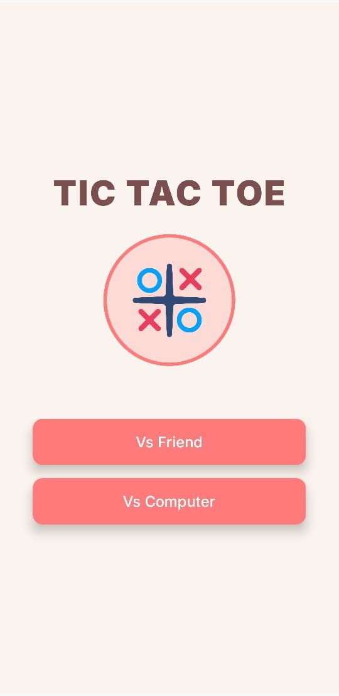

# Tic Tac Toe Game

  
  

## Introduction

Welcome to the Tic Tac Toe game, developed in Android Studio using Kotlin. This game includes two exciting modes: **Single Player** (versus Computer) and **Multiplayer** (versus Friend). You can also choose between two gameplay styles: the classic Tic Tac Toe or the **Infinite Game** mode, which adds a fun twist to the traditional gameplay, making it more strategic and engaging!

## Gameplay Showcase

### Game Modes

1. **Single Player Mode:** Play against the computer in a challenging match where you can test your skills against an AI opponent.

2. **Multiplayer Mode:** Play with your friend on the same device, taking turns to see who can win in the ultimate showdown.

### Game Styles

1. **Classic Tic Tac Toe:** This is the standard version of the game, where you can place your X or O on a 3x3 grid and try to get three in a row to win.

2. **Infinite Game Mode:** In this version, each player can only have a maximum of 3 symbols on the board at any given time. When a player plays their 4th move, their oldest symbol disappears, and the board resets slightly. This creates a more dynamic and strategic game that requires players to think ahead and plan carefully.

### Images

### Video

Watch a gameplay video to see Tic Tac Toe in action:

    
     Press the button to watch a video of the gameplay on YouTube

## Game Mechanics

1. *Single Player Mode:* Play against a computer opponent with adjustable difficulty.
   
2. *Multiplayer Mode:* Play locally with a friend, taking turns to place your marks on the board.

3. *Infinite Game Mode:* You can only have 3 symbols on the board at a time, and the 4th symbol removes your oldest mark, creating a dynamic and strategic game.

4. *Classic Tic Tac Toe:* The traditional 3x3 grid with standard rules for matching symbols in a row, column, or diagonal.

5. *Timed Rounds:* Choose to play with or without time limits, adding a bit of challenge and excitement.

6. *Scoring System:* Track your victories and losses in both modes, and challenge yourself to improve.

## How to Play

### Controls

- **Tap on a cell** to place your symbol (X or O) in that spot.
- **Single Player Mode:** Play against the computer; the computer will automatically make its move after you.
- **Multiplayer Mode:** Take turns with your friend, tapping on the cells to place your symbols.
- **Infinite Game Mode:** Remember, you can only have 3 symbols on the board at a time. Plan ahead and remove your oldest symbol when you play your 4th turn.

### Game Objective

- The goal is to be the first to get three of your symbols (X or O) in a row, either horizontally, vertically, or diagonally.
- In **Infinite Mode**, manage your limited symbols carefully and try to outsmart your opponent by making strategic moves that force them into a tough spot.

## Download and Setup

To download and play the Tic Tac Toe game, follow these steps:

#### Prerequisites

1. **Android Studio:** Download and install [Android Studio](https://developer.android.com/studio) to build and run the app.

#### Setup Instructions

1. **Clone the Repository:**
   - Open Android Studio.
   - Go to **File -> New -> Project from Version Control -> Git**.
   - Enter the repository URL to clone the project (e.g., https://github.com/YourUsername/TicTacToeGame).
   
2. **Run the Game:**
   - Open the project in Android Studio.
   - Build the project to ensure all dependencies are resolved.
   - Select a device or emulator and run the project to start playing Tic Tac Toe!
